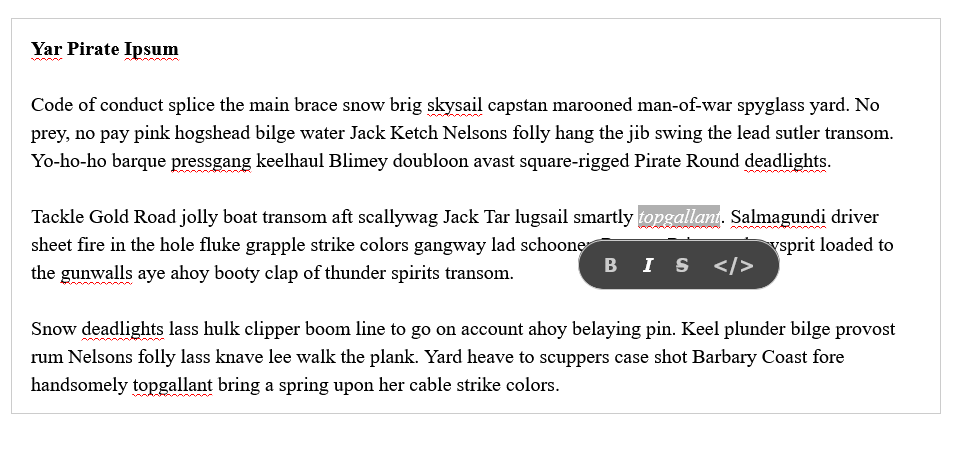

# WhatsApp Editor

A simple "Quilljs-bubble-theme" inspired editor that can output WhatsApp formatted text.



## Why?

A conversation with colleague inspired this and also as a learning experience.

## Get Started

### Step 1. First install the package

```
npm install whatsapp-editor 
```

### Step 2. Import the required CSS

```js
import 'whatsapp-editor/styles/prosemirror.css';
import 'whatsapp-editor/styles/whatsapp-editor.css';
```

### Step 3. Initialize the editor

```js
import { WhatsAppEditor } from "whatsapp-editor";

const editor = new WhatsAppEditor(
  {
    position: "BOTTOM", // tooltip position
    distance: 10 // tooltip distance (in px) from the selected text
  },
  document.querySelector("#editor") // DOM Element where the editor is to be mounted
);

console.log(editor.getWhatsappMarkdown()) // outputs WhatsApp-style-markdown string
```

That's it!

## Configurations

The editor _requires_ the configuration parameters (the first argument to the constructor) which determine the tooltip position.

```ts
interface TooltipPosition {
  position: "TOP" | "BOTTOM" | "LEFT" | "RIGHT";
  distance: number; // distance from the selected text (in px)
}

class WhatsAppEditor extends EditorView {
  constructor(
    tooltipOptions: TooltipPosition, 
    ...args: ConstructorParameters<typeof EditorView>
  );
  getWhatsappMarkdown(): string | null;
}
```

## Shortcuts

Following shortcuts have been implemented.

- `Ctrl/⌘ + z`: Undo
- `Ctrl/⌘ + y`: Redo
- `Ctrl/⌘ + b`: Bold
- `Ctrl/⌘ + i`: Italic
- `Alt/⌥ + s`: Strikethrough
- `Ctrl/⌘ + m`: Monospace

_Note: Undo, redo shortcuts are not supported yet._

## Limitations

Typing Whatsapp-markdown directly _will not_ convert the text style automatically. Meaning if you type:

```txt
We'll see you at *4PM*
```
it **_will not_** become:

```html
<p>We'll see you at <strong>4PM</strong></p>
```

## Advanced

### Prosemirror

The editor uses [Prosemirror](https://prosemirror.net/) under-the-hood, so you can pass in your own `Schema` and `EditorState` if you'd like. For example:

```js
import { WhatsAppEditor } from "./src/index.ts";

// an example schema from https://prosemirror.net/examples/schema/
const noteSchema = new Schema({
  nodes: {
    text: {},
    note: {
      content: "text*",
      toDOM() {
        return ["note", 0];
      },
      parseDOM: [{ tag: "note" }],
    },
    notegroup: {
      content: "note+",
      toDOM() {
        return ["notegroup", 0];
      },
      parseDOM: [{ tag: "notegroup" }],
    },
    doc: {
      content: "(note | notegroup)+",
    },
  },
});

const noteState = EditorState.create({
  schema: noteSchema,
});

const editor = new WhatsAppEditor(
  {
    position: "RIGHT",
    distance: 10 
  },
  // dom element
  document.querySelector("#editor"),
  // EditorView props
  { 
    state: noteState 
  }
);
```

_Note: If you change the schema, the tooltip and the `WhatsAppEditor.getWhatsappMarkdown()` method will not work._

### CSS

If you do want to customize the css you can over-ride any of the following css-variables.

```css
  --editor-border: 1px solid #ccc;
  --editor-line-height: 1.4;
  --editor-padding: 12px 15px;

  --tooltip-background-color: #444;
  --tooltip-border-radius: 25px;
  --tooltip-color: #ccc;
  --tooltip-padding: 0 10px;

  --tooltip-btn-padding: 10px;
  --tooltip-btn-font-size: 15px;
  --tooltip-btn-active: #fff;
```

Or don't include the bundled css and write your own!